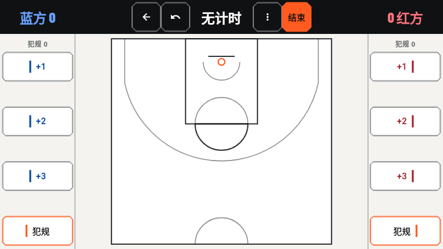
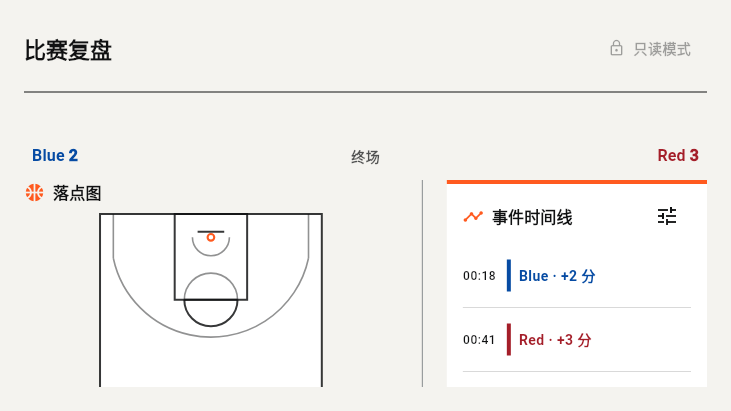

# HoopTrace

[](https://github.com/x1a0Y4NGren/hooptrace/actions/workflows/flutter-ci.yml)
[](https://github.com/x1a0Y4NGren/hooptrace/releases/latest)
[](LICENSE)

> 把注意力留给球场，把比分、落点和复盘交给 HoopTrace。

HoopTrace 是一款为篮球爱好者准备的离线单挑记录与复盘工具。一台手机横过来，就能记比分、犯规、比赛事件和投篮落点；打完球再回头看看比分走势、出手分布和关键回合，弄明白哪一片篮筐今天格外不给面子。

球可以打铁，记录不能糊涂。

> **永久承诺：HoopTrace 官方项目将始终免费并保持开源。** 官方版本不会加入付费墙、订阅、广告或闭源核心功能。

**[下载 v1.0.0 正式版](https://github.com/x1a0Y4NGren/hooptrace/releases/tag/v1.0.0)** · [查看本次更新](docs/release/v1.0.0-release-notes.md) · [隐私说明](PRIVACY.md) · [参与贡献](CONTRIBUTING.md)

> 从 `v0.1.0` 升级前，请先导出需要保留的资料，再清除旧应用数据并安装 `v1.0.0`。本次版本不会静默迁移或清空旧数据库。

## 先看比赛，不看说明书

<p align="center">
  
  
</p>

<p align="center"><sub>左边负责当场记清楚，右边负责赛后讲明白。</sub></p>

## 三步打完一场球

1. **开球前**：填好双方名称，选择规则、目标分和是否计时。
2. **得分时**：可以先点球场再选分值，也可以先记分、在 10 秒内补上落点；记错一步就撤回一步。
3. **终场后**：查看比分走势、事件时间线、投篮图和单场统计，需要时还能修正记录并保留审计痕迹。

全程不需要账号，不需要网络，也不用在暂停时和复杂表格斗智斗勇。

## 它会记住什么

- 统一横屏计分界面：左右固定为 `+1 / +2 / +3 / 犯规`，球场始终是视觉中心。
- 既支持“先点球场、再选球队和分值”，也支持“先得分、10 秒内补记位置”。
- 所有记录动作都能逐步撤回；暂停、继续和结束比赛都有明确入口与确认流程。
- 未中、罚球、球权、备注和自定义事件收进“更多”，现场界面保持清爽。
- 自定义球员名称、规则模板、目标分和计时设置。
- 本机比赛历史、事件时间线、投篮图、比分走势、单场统计与球员生涯分析。
- 带审计记录的赛后事件和落点修正，改过什么有迹可循。
- 完整 JSON 备份与恢复、CSV 导出和复盘图片分享。
- 用户授权目录内的可选自动备份，默认关闭，选择权始终在你手里。
- 标准、精简和系统关闭动画三种反馈路径；核心计分完全不依赖动画成功与否。

## 当前阵容

- 当前正式版：[HoopTrace `v1.0.0`](https://github.com/x1a0Y4NGren/hooptrace/releases/tag/v1.0.0)，Android APK 已使用项目正式证书签名发布。
- 当前平台：Android 优先，最低 Android API 24，目标 Android API 36。
- Android Application ID：`io.github.x1a0y4ngren.hooptrace`。
- iOS 无签名编译已纳入 CI，但尚未完成真机验收和正式发布。
- 界面完整支持简体中文和英文；首次打开默认中文，用户可在设置中切换英文。主题可跟随系统或固定为浅色/深色。

## 隐私与离线原则

没有账号，没有广告，也不会悄悄把你的比赛送上云端。比赛、球员、规则和设置都保存在设备本地 SQLite 数据库中；应用不包含分析 SDK、追踪 SDK、崩溃遥测或运营后端。

只有在你主动导出、分享或选择备份目录时，数据才会离开应用私有目录。之后的处理由你选择的系统目录或分享目标负责。完整说明见 [PRIVACY.md](PRIVACY.md)。

## 把它跑起来

推荐使用与当前项目一致的工具链：

- Flutter `3.41.9` stable
- Dart `3.11.5`
- Java 17
- Android SDK，包含可用的模拟器或 Android 设备

```powershell
git clone https://github.com/x1a0Y4NGren/hooptrace.git
cd hooptrace
flutter pub get
flutter doctor -v
flutter run -d <device-id>
```

计分页会自动要求横屏；主页、历史和设置等页面支持正常设备方向。

## 认真部分

俏皮归俏皮，CI 不放水：

```powershell
dart format --output=none --set-exit-if-changed .
flutter analyze
flutter test
flutter test integration_test/main_loop_test.dart -d <android-device-id>
flutter build apk --debug
```

集成测试会使用每次运行唯一的测试球员名称，在测试设备上创建并结束一场本地比赛。

## 构建与发布

日常开发可以直接构建 Debug APK：

```powershell
flutter build apk --debug
```

Release APK 必须使用项目维护者保管的正式密钥签名。仓库不会保存密钥；本地签名配置使用被 Git 忽略的 `android/key.properties`。没有密钥时普通 Release 构建会明确失败，只有 F-Droid 或可复现性验证可以显式选择未签名构建。完整流程见 [发布清单](docs/release/release-checklist.md)。

官方发布渠道：

1. [GitHub Releases](https://github.com/x1a0Y4NGren/hooptrace/releases) 提供签名 APK、校验和与源码归档。
2. 完成可复现构建核验后申请进入 F-Droid，准备说明见 [F-Droid Notes](docs/release/fdroid-notes.md)。这是 HoopTrace 为保持 GitHub 与 F-Droid 安装包签名一致而设置的项目门槛，并非 F-Droid 收录的一般性要求。

HoopTrace 不计划同时分发两个签名不同的官方 Android 包。F-Droid 首发前必须验证由相同源码重现并匹配 GitHub 上游签名 APK；在此之前，唯一的官方 APK 渠道是 GitHub Releases。这样可避免用户切换渠道时被迫卸载应用并承担本地数据丢失风险。

不要从未知来源安装声称由 HoopTrace 官方发布的 APK。正式版本应能对应到本仓库中的签名 Git tag 和 GitHub Release。

## 逛仓库不迷路

- `lib/app`：应用装配、路由、主题与本地化。
- `lib/core`：领域模型、Drift 数据库、分析、审计与导出。
- `lib/features`：计分、复盘、历史、球员、规则和设置页面。
- `test`：单元测试与 Widget 测试。
- `integration_test`：Android 主流程端到端测试。
- `docs`：规划、分支执行说明和发布资料。

## 欢迎上场

Bug、想法、文档改进和代码贡献都欢迎。提交 Issue 或 Pull Request 前请阅读 [CONTRIBUTING.md](CONTRIBUTING.md)。隐私、离线能力和永久免费开源承诺属于不可破坏的项目约束。

## 设计与动效资产

HoopTrace `v1.0.0` 使用统一的“黑场编辑部”界面：近黑比赛顶栏、冷白内容面和克制的竞技橙共同维持信息层级，红蓝只负责表达球队与比赛数据。比分、计时和现场操作优先保证快速辨认，不让装饰抢走比赛注意力。

`assets/animations/paint_ball.json` 与 `assets/animations/paint_splash.json` 是为 HoopTrace 原创的、自包含 Lottie JSON 动效，不含外部资源，随应用本地打包并支持离线运行。运行时使用 `lottie 3.3.3`，其 MIT 许可文本记录在 [THIRD_PARTY_NOTICES.md](THIRD_PARTY_NOTICES.md)。

## 许可证

代码和仓库内项目资产按 [MIT License](LICENSE) 发布。
