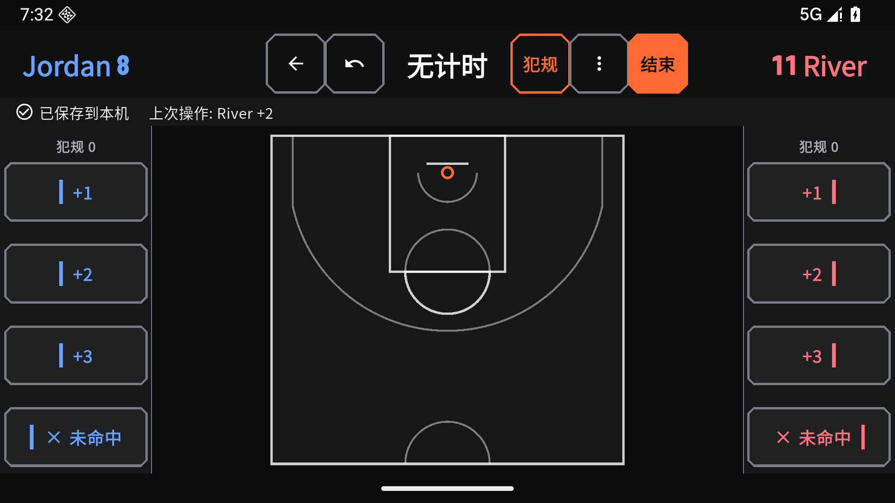
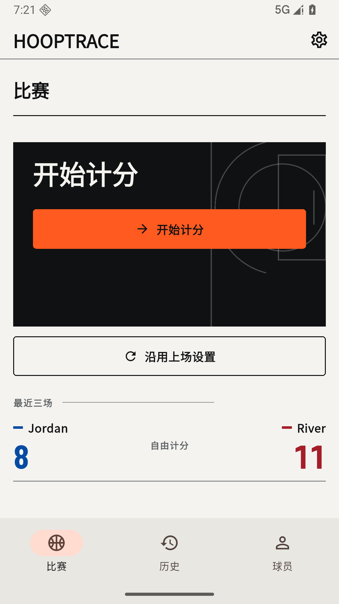
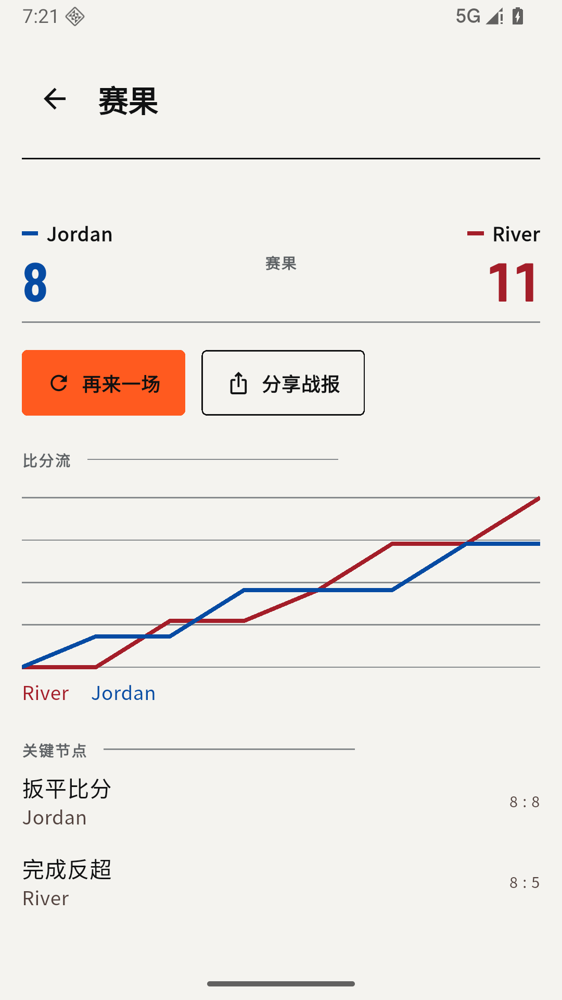

# HoopTrace

<p align="center">
  
</p>

[](https://github.com/x1a0Y4NGren/hooptrace/actions/workflows/flutter-ci.yml)
[](https://github.com/x1a0Y4NGren/hooptrace/releases/latest)
[](LICENSE)

> 把注意力留给球场，把比分、落点和复盘交给 HoopTrace。

HoopTrace 是一款为篮球爱好者准备的离线单挑记录与复盘工具。一台手机横过来，就能记比分、犯规、比赛事件和投篮落点；打完球再回头看看比分走势、出手分布和关键回合，弄明白哪一片篮筐今天格外不给面子。

球可以打铁，记录不能糊涂。

> **永久承诺：HoopTrace 官方项目将始终免费并保持开源。** 官方版本不会加入付费墙、订阅、广告或闭源核心功能。

**[下载 v1.0.0 正式版](https://github.com/x1a0Y4NGren/hooptrace/releases/tag/v1.0.0)** · [查看本次更新](docs/release/v1.0.0-release-notes.md) · [隐私说明](PRIVACY.md) · [参与贡献](CONTRIBUTING.md)

> 历史升级提示（`v0.1.0` → `v1.0.0`）：先导出需要保留的资料，再清除旧应用数据后安装 `v1.0.0`。该历史版本不会静默迁移或清空旧数据库。升级 2.0 候选请按下方指南保留现有数据。

当前开发候选为 **`2.0.0+4`，尚未正式发布**。它串起开赛、现场记录、赛后总结和球员成长，并加强替换恢复保护。最新应用源码 `a51203c` 保留 C「独眼球怪」、Q 弹启动动效及目标分 1～999 手动输入，修复动态动画模式切换时终场确认失效；1157 项测试、分析及完整远端 CI 通过，包括 API24／36 集成、Android 可复现构建和 macOS iOS 无签名编译。完整标准启动至首页录屏已取得，但 16.7ms 帧预算仍未通过；正式签名、同证升级、自然备份与正式包设备验收仍需完成。查看[发布前验收](docs/release/v2.0.0-pre-release-verification.md)、[候选记录](docs/release/v2.0.0-candidate.md)、[动效记录](docs/design/brand/entry-motion.md)及[升级指南](docs/release/v2.0.0-upgrade.md)。

## 先看比赛，不看说明书

<p align="center">
  
</p>

<p align="center">
  
  
</p>

<p align="center"><sub>2.0 候选的实际 Android 画面，使用虚构球员与演示对局。截图来自独立对局，拍摄版本与状态见<a href="docs/release/v2.0.0-screenshots.json">截图记录</a>。</sub></p>

## 三步打完一场球

1. **开球前**：使用临时名称、已有球员或新建档案；可复用上场配置，确认规则和准备记录的范围。
2. **得分时**：可以先点球场再选分值，也可以先记分、在 10 秒内补上落点；记错一步就撤回一步。
3. **终场后**：确认比分与出手完整度，查看总结、复盘或分享报告；可关联球员档案、再来一场，并查看成长记录。

全程不需要账号，不需要网络，也不用在暂停时和复杂表格斗智斗勇。

## 它会记住什么

- 统一横屏计分界面：左右固定为 `+1 / +2 / +3 / 未命中`，球场始终是视觉中心。
- 既支持“先点球场、再选命中或未中”，也支持先记录、在 10 秒内补记位置。
- 顶部集中提供撤回、犯规、更多和结束入口；犯规可快速选择蓝方或红方。
- 得分、落点、未中、犯规、罚球、球权、备注和自定义事件均可按提交顺序逐步撤回。
- 蓝红双方未中点可在当前计分页独立隐藏；白底配球队色叉号，在明暗主题下都能与命中点区分。
- 罚球、球权、备注和自定义事件收进“更多”，现场界面保持清爽。
- 自定义球员名称、规则模板、目标分和计时设置。
- 本机比赛历史、事件时间线、投篮图、比分走势、单场统计与球员生涯分析。
- 比赛、历史、球员三个主入口；最近结果直达总结，球员列表直达生涯。
- FG% 与 FT% 分开计算；未完整记录出手或分母为零时不显示可信命中率，落点图只表达已记录样本。
- 带审计记录的赛后事件和落点修正，改过什么有迹可循。
- 完整 JSON 备份与恢复、CSV 导出和复盘图片分享。
- 替换或回退前必须保存并校验应用内安全副本；数据页可恢复最近两份。安全副本不能代替设备外的 JSON 备份。
- 用户授权目录内的可选自动备份，默认关闭，选择权始终在你手里。
- 标准、精简和系统关闭动画三种反馈路径；核心计分完全不依赖动画成功与否。

## 当前阵容

- 当前正式版：[HoopTrace `v1.0.0`](https://github.com/x1a0Y4NGren/hooptrace/releases/tag/v1.0.0)，Android APK 已使用项目正式证书签名发布。
- 当前开发候选：`2.0.0+4`，应用源码 `6d1b6cc`。数据库仍为 schema 3，JSON 仍为格式 2；验收来源与剩余门槛见 [HANDOFF.md](HANDOFF.md)。
- 当前平台：Android 优先，最低 Android API 24，目标 Android API 36。
- Android Application ID：`io.github.x1a0y4ngren.hooptrace`。
- iOS 无签名编译已纳入 CI，但尚未完成真机验收和正式发布。
- 界面完整支持简体中文和英文；首次打开默认中文，用户可在设置中切换英文。主题可跟随系统或固定为浅色/深色。

## 隐私与离线原则

没有账号，没有广告，也不会悄悄把你的比赛送上云端。比赛、球员、规则和设置都保存在设备本地 SQLite 数据库中；应用不包含分析 SDK、追踪 SDK、崩溃遥测或运营后端。

只有在你主动导出、分享或选择备份目录时，数据才会离开应用私有目录。之后的处理由你选择的系统目录或分享目标负责。完整说明见 [PRIVACY.md](PRIVACY.md)。

完整 JSON 的导出与导入均限制为 32 MiB、单表 100,000 行、总计 200,000 行；超限会给出实际值与上限，并保留原数据。CSV 用于阅读和外部分析，不能完整恢复比赛。候选版球员统计 CSV 改为 13 列，分别提供 FG/FT 计数和命中率；详见[数据兼容契约](docs/release/v2.0.0-upgrade.md#csv-13-列契约)。

## 把它跑起来

推荐使用与当前项目一致的工具链：

- Flutter `3.41.9` stable
- Dart `3.11.5`
- Java 17
- Android SDK，包含可用的模拟器或 Android 设备

```powershell
git clone https://github.com/x1a0Y4NGren/hooptrace.git
cd hooptrace
flutter pub get
flutter doctor -v
flutter run -d <device-id>
```

计分页会自动要求横屏；主页、历史和设置等页面支持正常设备方向。

## 认真部分

俏皮归俏皮，CI 不放水。以下为完整验证常用命令；日常修改按 [贡献指南](CONTRIBUTING.md#测试要求) 选择相关检查，修一段文案不必重建整个 APK：

```powershell
dart format --output=none --set-exit-if-changed .
flutter analyze
flutter test
flutter test integration_test/main_loop_test.dart -d <android-device-id>
flutter build apk --debug
```

主流程集成测试使用隔离的内存数据库；文件恢复测试使用临时 SQLite 文件，关闭重开不能代替进程重启验收。Flutter 测试运行器结束时会卸载该 Android 用户下的应用，请使用专用测试设备或独立测试用户，并通过 `--device-user <id>` 指定用户。手动安装验收前重新构建普通 MAIN Debug APK，以免安装到测试入口。

## 构建与发布

日常开发可以直接构建 Debug APK：

```powershell
flutter build apk --debug
```

Release APK 必须使用项目维护者保管的正式密钥签名。仓库不会保存密钥；本地签名配置使用被 Git 忽略的 `android/key.properties`。没有密钥时普通 Release 构建会明确失败，只有 F-Droid 或可复现性验证可以显式选择未签名构建。完整流程见 [发布清单](docs/release/release-checklist.md)。

官方发布渠道：

1. [GitHub Releases](https://github.com/x1a0Y4NGren/hooptrace/releases) 提供签名 APK、校验和与源码归档。
2. 完成可复现构建核验后申请进入 F-Droid，准备说明见 [F-Droid Notes](docs/release/fdroid-notes.md)。这是 HoopTrace 为保持 GitHub 与 F-Droid 安装包签名一致而设置的项目门槛，并非 F-Droid 收录的一般性要求。

HoopTrace 不计划同时分发两个签名不同的官方 Android 包。F-Droid 首发前必须验证由相同源码重现并匹配 GitHub 上游签名 APK；在此之前，唯一的官方 APK 渠道是 GitHub Releases。这样可避免用户切换渠道时被迫卸载应用并承担本地数据丢失风险。

不要从未知来源安装声称由 HoopTrace 官方发布的 APK。正式版本应能对应到本仓库中的签名 Git tag 和 GitHub Release。

## 逛仓库不迷路

- `lib/app`：应用装配、路由、主题与本地化。
- `lib/core`：领域模型、Drift 数据库、分析、审计与导出。
- `lib/features`：计分、复盘、历史、球员、规则和设置页面。
- `test`：单元测试与 Widget 测试。
- `integration_test`：Android 主流程端到端测试。
- [docs](docs/README.md)：当前文档入口、设计记录和发布资料。

## 欢迎上场

Bug、想法、文档改进和代码贡献都欢迎。提交 Issue 或 Pull Request 前请阅读 [CONTRIBUTING.md](CONTRIBUTING.md)。隐私、离线能力和永久免费开源承诺属于不可破坏的项目约束。

## 设计与动效资产

HoopTrace `v1.0.0` 使用统一的“黑场编辑部”界面：近黑比赛顶栏、冷白内容面和克制的竞技橙共同维持信息层级，红蓝只负责表达球队与比赛数据。比分、计时和现场操作优先保证快速辨认，不让装饰抢走比赛注意力。

2.0 候选统一使用已审核的 C「独眼球怪」平台图标和启动画面；Flutter 启动层采用原图纹理网格，提供约一秒的 Q 弹跳跃、上半部水波与收尾余波，全程静音。原图与资源来源见[品牌记录](docs/design/brand/README.md)，设计参数、预览及设备验收范围见[启动动效记录](docs/design/brand/entry-motion.md)。

`assets/animations/paint_ball.json` 与 `assets/animations/paint_splash.json` 是为 HoopTrace 原创的、自包含 Lottie JSON 动效，不含外部资源，随应用本地打包并支持离线运行。运行时使用 `lottie 3.3.3`，其 MIT 许可文本记录在 [THIRD_PARTY_NOTICES.md](THIRD_PARTY_NOTICES.md)。

## 许可证

代码和仓库内项目资产按 [MIT License](LICENSE) 发布。
